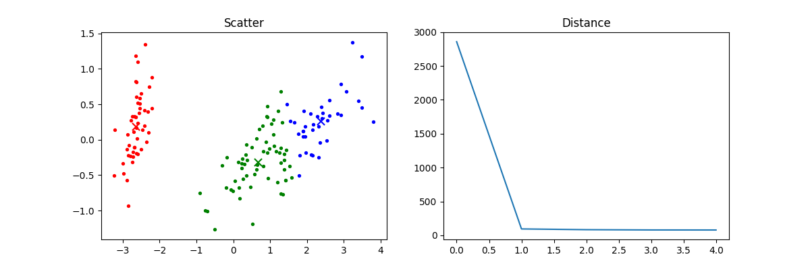
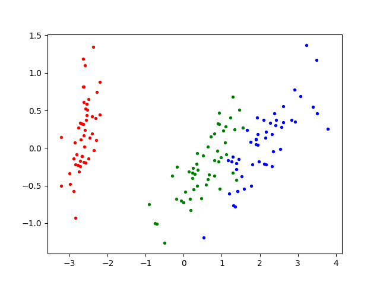
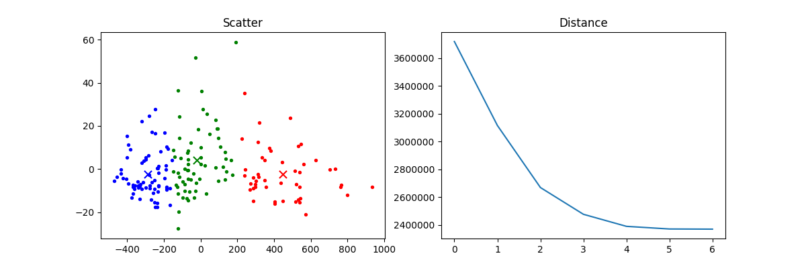
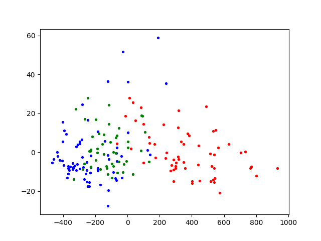

# Assignment 3

auth: Qian yu 1831582


## Dataset Chosen & Main Characteristics

The two datasets 'Iris' and 'Wine' are chosen for experiment.

### Iris

Iris dataset has 150 records totally, divided into three types or iris —— I. setosa, I. versicolor and I. virginica, 50 records for each and this dataset has 4 dimensions —— Sepal length, Sepal width, Petal length and Petal width with the type of float. This is perhaps the best known database to be found in the pattern recognition literature. Fisher's paper is a classic in the field and is referenced frequently to this day.

Download Link: http://archive.ics.uci.edu/ml/machine-learning-databases/iris/iris.data

### Wine

These data are the results of a chemical analysis of wines grown in the same region in Italy but derived from three different cultivars. The analysis determined the quantities of 13 constituents found in each of the three types of wines. Wine dataset has 178 records totally, divided into three kinds and this dataset has 13 dimensions —— Alcohol, Malic acid, Ash, Alcalinity of ash, Magnesium, Total phenols, Flavanoids, Nonflavanoid phenols, Proanthocyanins, Color intensity, Hue, OD280/OD315 of diluted wines and Proline. 

Download Link: http://archive.ics.uci.edu/ml/machine-learning-databases/wine/wine.data


## Running Example

There are two exaples in the  `/src` , using iris dataset and wine dataset. The dependences are as below:

- Python 3
- Numpy
- Sklearn  (For dimensionality reduction while drawing charts)
- Matplotlib (For drawing charts)

You can run the iris example by running the below command in your terminal to start the example:

``` python
python iris_example.py
```

You can run the wine example by running the below command in you terminal to start the example:

``` python
python wine_example.py
```


## Data Preprocessing Operations

Before training, data preprocessing operations should be finished firstly for fitting the need of train module and for a better result.

I use all dimensions in the datasets, for iris dataset the 'usecols' is (0, 1, 2, 3) and for wine dataset it's (1, 2, 3, 4, 5, 6, 7, 8, 9, 10, 11, 12, 13).

There are more than two dimensions in the two datasets, so dimensionlity reduction operation is necessary. During clusting they keep their origin dimensions and they will be reduced to 2 dimensions after clusting.


## Modules Designing

The implement of kmeans is as below:

* __init__:
    `def __init__(self, k)`
    The initializing method has just one parameter —— k, which defined the counts of clusters. This method will initialize the kmeans object.

* loadtxt:
    `def loadtxt(self, path, delimiter=',', usecols=None, dtype=float)`
    This method load the dataset from the file at given path. The defaule of delimiter of dataset file is ',', the usecols is None and the data type is float.

* __distance:
    `def __distance(self, a, b)`
    This method is used to calculate the distance between tensor a and tensor b.

* __point_avg:
    `def __point_avg(self, points)`
    This method is used to calculate the average distrance between points and their center

* __assign_points:
    `def __assign_points(self, centers)`
    This method assign each point to the shortest center and save the new assignment.

* __calculate_center_and_distance:
    `def __calculate_center_and_distance(self, means)`
    This method is used to calculate the new center and store the history of distance and return the new centers.

* __generate:
    `def __generate(self)`
    This methor is used to generate the centers. It find the minimum and maximum for each dimension. This method return a random center with the value between the minimum and maximum in each dimensions.

* run:
    `def run(self)`
    This is the main method of kmeans. By call run method the kmeans will execute the kmeans method and store the results.

* show:
    `def show(self, n_components=2)`
    This method is used to draw charts.


## Clustering Results & Interpretation

### Iris

The clustering results of iris is as below:



The left chart show the clustering result. When k = 3, kmeans divided the iris data into 3 different clusters and show them in three different color. The right chart show the variation curve of total distance from each points to their center.

The chart showing the iris data divided by their kinds is as below:



It's easy to find that their are many diffenent between clustering result and the origin kinds. It's because that kmeans algorithm is unsupervised which means that the algorithm does not know the label of dataset and divided only by the distance.

### Wine

The clustering result of wine dataset is as below:



The left chart show the clustering result. When k = 3, kmeans divided the wine data into 3 different clusters and show them in three different color. The right chart show the variation curve of total distance from each points to their center.



It's easy to find that their are many diffenent between clustering result and the origin kinds. It's because that kmeans algorithm is unsupervised which means that the algorithm does not know the label of dataset and divided only by the distance.

## Limitations & Possible Improvements

Because the initialized centers are random, in some cases, some of the centers are so far away from all points so that no point will be assigned to them. So it is necessary to run the algorithm for more than one times to ensure that the results is as we expected.

The number k is given in advance that it is not modifiable but the best k is unpredictable. So we have to try a huge number of value of k which wastes lots of time.
